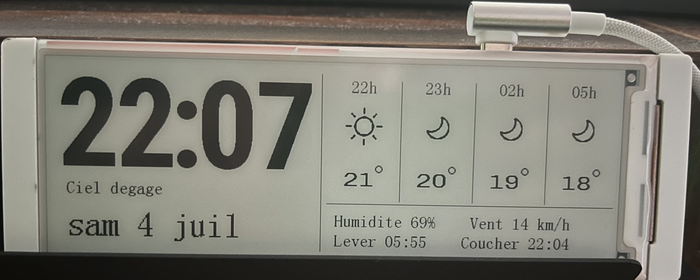

# E-paper Clock & Weather — CrowPanel 5.79"

[Français](README.md) · **English**

A minimalist clock and weather station on the **CrowPanel ESP32 5.79" e-paper
display** (792×272, ESP32-S3), built with **PlatformIO**. Time synced over NTP,
weather from OpenWeatherMap, and a rotary wheel to navigate between pages.



## Features

- ⏰ **Clock** synced over NTP (timezone + daylight saving handled)
- 🌤️ **Live weather** (OpenWeatherMap): conditions, temperature, humidity,
  wind, sunrise/sunset
- 🖥️ **4 pages**, navigated with the rotary wheel:
  1. Clock + weather (banner: time, +3h/+6h/+9h forecast, info bar)
  2. Full-screen clock
  3. 24h temperature graph + rain probability
  4. 5-day forecast (icon + min/max)
- 🎛️ **Selection menu** (press the wheel) to pick a page
- ✨ Large, crisp fonts (rendered at native resolution, not upscaled)
- 🔄 Per-minute partial refresh **without ghosting** + periodic full refresh

## Hardware

- [Elecrow CrowPanel ESP32 E-Paper HMI 5.79" (792×272, B/W)](https://www.elecrow.com/crowpanel-esp32-5-79-e-paper-hmi-display-with-272-792-resolution-black-white-color-driven-by-spi-interface.html)
- USB-C cable (power + flashing)

No extra wiring: the display, the ESP32-S3 and the rotary wheel are all on the board.

## Setup

1. Install [PlatformIO](https://platformio.org/) (Core or the VS Code extension).
2. Copy the config template and fill it in:
   ```bash
   cp src/config.template.h src/config.h
   ```
   Set: WiFi SSID/password (**2.4 GHz only**), a free
   [OpenWeatherMap](https://openweathermap.org/api) API key, and your city
   (format `City,CC`, no accents).
3. Build and flash:
   ```bash
   pio run -t upload
   ```
   > If upload fails at 921600 baud, it's already set to 460800 in
   > `platformio.ini` (the UART chip dislikes the top speed).

`src/config.h` holds your secrets and is **excluded from the repo** (`.gitignore`).

## Navigation

| Action | Effect |
|---|---|
| Turn the wheel | Next / previous page |
| Press (OK) | Open the selection menu |
| In menu: turn | Move the cursor |
| In menu: OK | Confirm selection |
| In menu: Exit | Cancel |

## Regenerating the fonts

The large digits are generated from a TTF font (Roboto Condensed by default):

```bash
pip install pillow
python3 tools/genfont.py /path/to/font.ttf   # updates bigfont.h, bigfontxl.h, textfont.h
```

## Gotchas (useful if you pick up this board)

- **GPIO 7 = panel power.** You must `digitalWrite(7, HIGH)` before using the
  display, otherwise the controller never responds and the code hangs in the
  `BUSY` wait loop (blank screen). Not documented in the older examples.
- **GxEPD2 does not work** on this panel: it's driven by **two cascaded SSD1683
  controllers** (2×396×272 with an offset). This project uses the Elecrow driver
  (software SPI).
- **Refresh:** `EPD_FastMode1Init()` does a hardware reset — don't call it every
  minute (it breaks the differential and causes ghosting). Init once, then use
  `EPD_Display` + `EPD_PartUpdate` for fast updates, plus a periodic full refresh
  to clean up.
- **Accents:** the text font is generated with French accented characters
  (`src/textfont.h`) and drawn by a **UTF-8** renderer (`EPD_ShowText`), so
  "Température", "dégagé", "août"… render correctly.
- **Rotary wheel** = a 5-way switch read as active-low buttons
  (GPIO 4 = next, 6 = previous, 5 = OK, 1 = exit).

## Credits & licenses

Based on the driver by [cubic9com](https://github.com/cubic9com/crowpanel-5.79_weather-display)
(MIT) and Elecrow's demo code. See [CREDITS.md](CREDITS.md) for details.

This project's code is licensed under [MIT](LICENSE).
